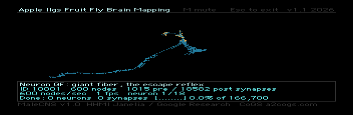
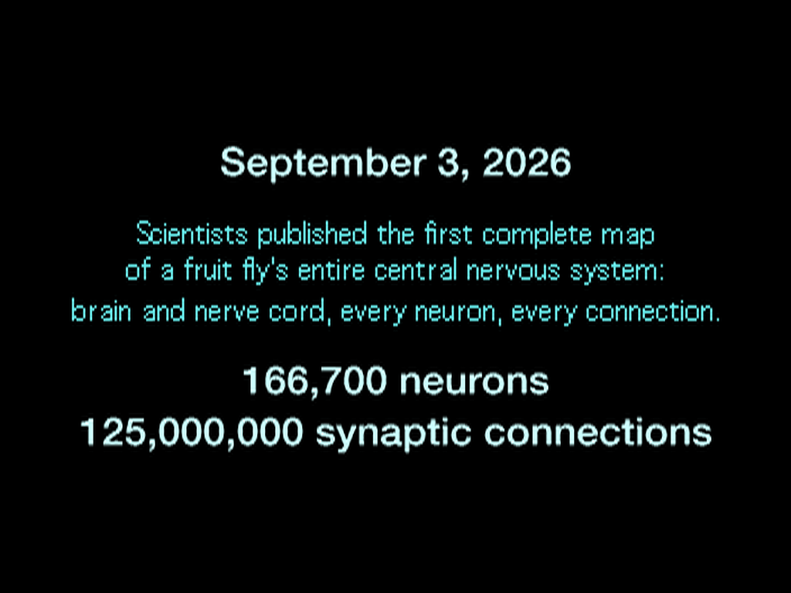
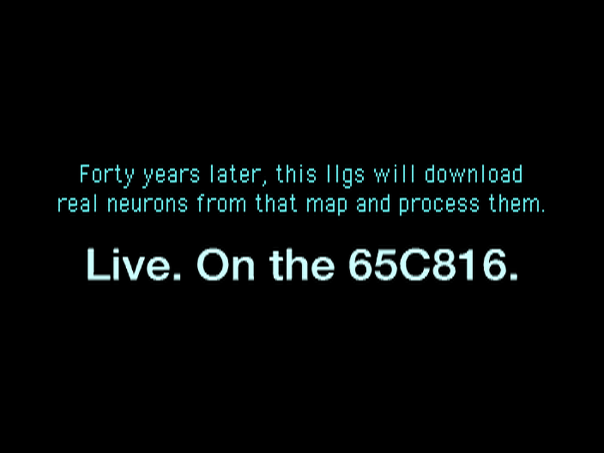
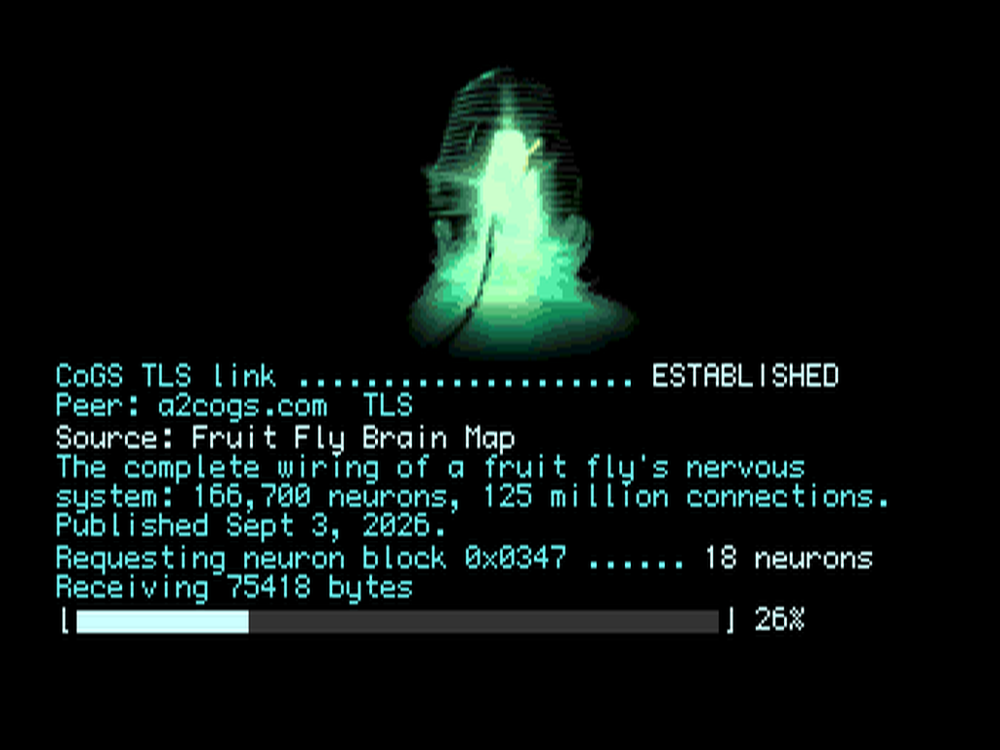
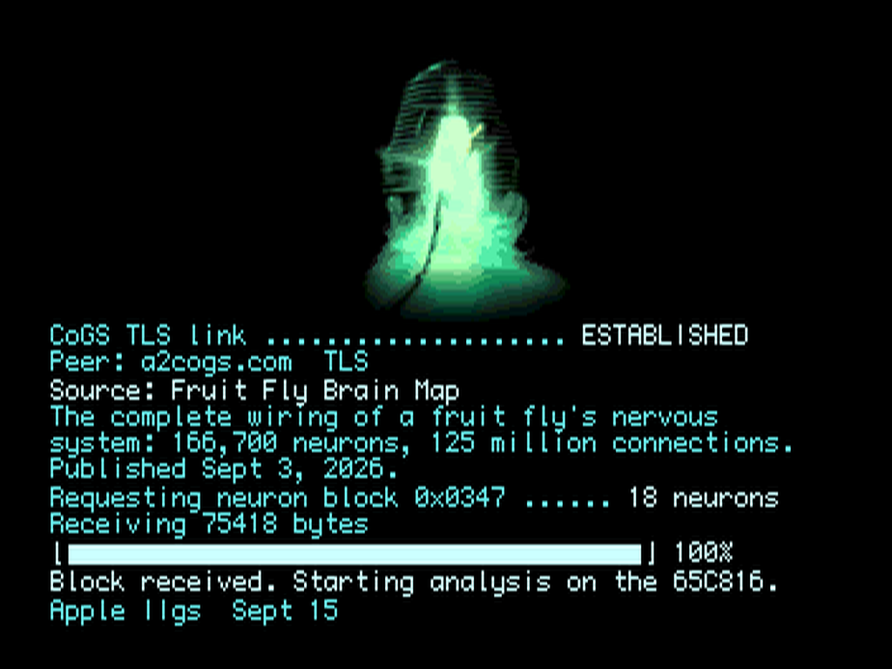
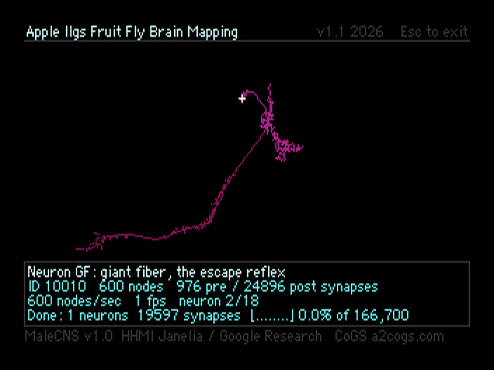
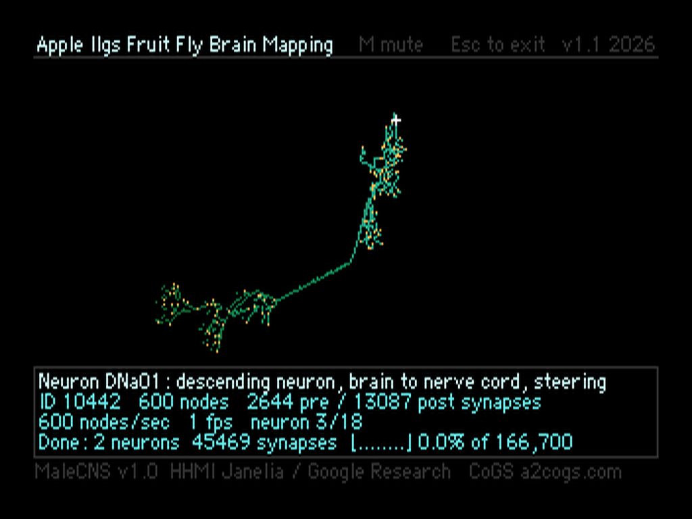

# GS FLY

**An Apple IIgs pulls real neurons out of the first complete fruit fly connectome and rotates them on a 65C816. Built for the IIgs 40th anniversary, September 15, 2026.**



On September 3, 2026, HHMI Janelia and Google Research published MaleCNS v1.0, the first complete wiring map of a fruit fly's entire central nervous system: brain and nerve cord, 166,700 neurons, about 125 million synaptic connections. Twelve days later, forty years to the day after Apple announced the IIgs, this program loads a block of those neurons onto a 2.8 MHz IIgs, spins each one in 3D with depth shading, and keeps a running benchmark of how fast the 65C816 is chewing through the map.

Every number on the screen comes from the data or the tick counter. Nothing is faked.

## What you see

1. **Title cards** at 640x200 in anti-aliased Helvetica Neue and hinted Geneva, palette-faded.
2. **Boot console.** With a [CoGS](https://a2cogs.com) card in the machine, the IIgs opens a TLS session to `a2cogs.com`, prints the negotiated TLS version and cipher, and streams the neuron block down through the card with a live progress bar driven by the bytes as they land. Without a card it says so and loads the same block from disk.
3. **Viewer.** One neuron at a time: real skeleton nodes rotated about Y, depth-shaded through a 12-step ramp, branch terminals marked, soma marked, with the neuron's cell type, a plain-English tag, its bodyId, node count, and presynaptic / postsynaptic site counts from the dataset. Underneath: nodes transformed per second, frames per second, neurons processed, synapses accounted for, and a projection of how long the full 166,700-neuron connectome would take at this rate.

| | |
|---|---|
|  |  |
|  |  |
|  |  |

(Screenshots are from the headless MAME harness with the virtual CoGS card, which is why the Peer line has no cipher; a real card fills in `TLS 1.3` and the suite.)

## The data

`GSFLY.DATA` is 75,418 bytes: 18 neurons of 9 cell types from MaleCNS v1.0, fetched through [neuPrint](https://neuprint.janelia.org) with `neuprint-python` and `navis`, then packed by `pack_fly.py`.

| type | what it is | in the block |
|---|---|---|
| GF (DNp01) | giant fiber, the escape reflex | 2 |
| DNa01, DNa02 | descending neurons, brain to nerve cord | 4 |
| MBON01, MBON03 | mushroom body output, memory readout | 4 |
| LC10 (LC10a), LC4 | visual projection neurons | 4 |
| PPL101 | dopamine neuron, reward and punishment learning | 2 |
| aMe12 | circadian clock neuron | 2 |

Each skeleton is capped at 600 nodes. MaleCNS skeletons run 400 to 13,000 nodes, so the packer prunes the shortest terminal twigs first until 600 remain, keeping root, branch points and the long cable. Coordinates are centered on the centroid and scaled to plus or minus 30,000 as int16. Synapse counts (`pre`, `post`) are the dataset's own per-neuron totals, not derived.

```
FLY1  u16 count
per neuron:
  u32 bodyId   char[16] type   u16 nNodes   u32 pre   u32 post
  int16 x,y,z * nNodes          u16 parent * nNodes  (0xFFFF = root)
```

## How the IIgs does it

- **Per-scanline video modes.** The IIgs lets each of the 200 scanlines pick 320 or 640 mode and one of 16 palettes. The viewport (rows 10 to 146) is 320 mode with a 16-color depth ramp. Every text row on the screen, and the whole console, is 640 mode with a 4-level palette, drawn with hinted 9-pixel Geneva and Monaco doubled horizontally. Same frame, two resolutions.
- **16-bit rotation.** When a neuron comes up it is pre-scaled once into screen units (|x|, |z| <= 126). With a 7-bit sine the per-frame rotation `x*cos - z*sin` stays inside 16 bits, so the transform is all native `int` math. The long divides happen once per neuron, not 600 times a frame.
- **Segment-interleaved redraw.** At one or two frames a second a full erase pass followed by a draw pass would blink. Each segment is erased and redrawn in turn, so the neuron never leaves the screen.
- **Real benchmarks.** `nodes/sec` and `fps` are counted against the 60 Hz tick. `Done` accumulates neurons after their 12-second dwell (or Space). The "full connectome in N days" line is `166700 / N * elapsed`.
- **Chrome that does not flicker.** Data lines redraw glyph over glyph, then black the tail, so numbers update in place.

Stock IIgs: about 1 frame a second on a 600-node neuron. With an accelerator, two or three.

## The CoGS path

[CoGS](https://a2cogs.com) is a co-processor and network card for the Apple II (RP2350, Wi-Fi, TLS 1.2/1.3 terminated on the card). GS FLY uses the same client library the CoGS Control Panel uses:

1. Scan slots 1 to 7 for the card signature, check the link is up.
2. `GET https://a2cogs.com/fly/GSFLY.DATA` with `Range: bytes=0-31`. That one request does DNS, TCP and the TLS handshake on the card, confirms the URL is live, and returns the header (magic, count) that the console prints.
3. `TLS_INFO` for the Peer line.
4. Stream the full file through the card's FIFO. Every DATA frame moves the bar; the byte count on screen is the transfer.
5. Swap the downloaded block in for the disk copy before the viewer starts.

So if the block on the server changes, the GS renders the new one. The disk copy exists so anyone can run the demo without a card.

## Running it

**Release images** (see Releases):

- `gsfly800.2mg`: 800K ProDOS floppy, volume `/GSFLY800` (so it can sit next to the 32 MB `/GSFLY` boot volume). Boot GS/OS from anything, mount this, run `GSFLY`.
- `gsfly.2mg`: 32 MB GS/OS 6.0.4 boot volume with `GSFLY/` on it (also carries the CoGS tools). Boot it from a CFFA, or in Ample as a hard disk, open the `GSFLY` folder, run `GSFLY`.

Controls: any key skips the intro. `Space` next neuron, `A` toggles auto-advance (12 s), `Esc` exits from anywhere, including mid-download.

Tested on Ample (MAME) with ROM 3, and on a ROM 01 IIgs with a CoGS card in slot 3.

## Building

Host side needs Python 3 with `neuprint-python`, `navis`, `numpy`, `Pillow`, and a free neuPrint token in `NEUPRINT_TOKEN`:

```
python3 pack_fly.py            # FLYDATA.BIN from MaleCNS v1.0
python3 gen_cards.py           # FLYCARDS.BIN, the three 640-mode title cards
python3 gen_font640.py         # font640.h from Geneva 9 / Monaco 9
python3 gen_boot_shr.py        # FLYBOOT.shr, the console backdrop
```

GS side is ORCA/C via Golden Gate (`occ`, `iix`). `build.sh` compiles `fly.c` plus the two `cogslib` files in `lib/` (from the CoGS repo, kept at `-O0` for the reasons in its Makefile) and `inject.sh` lays the four GS files onto the disk images with AppleCommander and re-wraps the 2IMG header. `test/run_snap.sh` boots the result in headless MAME and screenshots it; `MAME_EXTRA="-sl3 cogs"` adds the virtual card.

Two ORCA/C notes that cost an evening: `pointer + unsigned` with a constant long base miscompiles (use a table of row pointers), and a static initializer holding the address of another static array relocates wrong once the link has more than one object file (bind those at run time).

## Credits

- MaleCNS v1.0: HHMI Janelia Research Campus and Google Research. Data via neuPrint.
- `neuprint-python` and `navis` for the fetch and skeleton handling.
- Console backdrop is a crop of the 1986 *The Fly* poster, which opened a month before the IIgs shipped.
- Rob Perissi, September 2026. MIT license.
